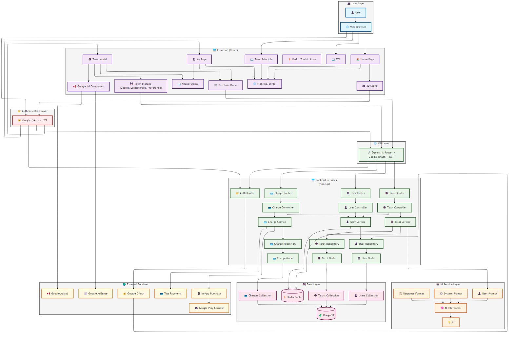

<div align="center">

# 🌌 Cosmos Tarot

### _수익 창출형 타로 웹/앱 서비스_

### _Revenue-Generating Tarot Web/App Service_

### _収益創出型タロット Web/アプリサービス_

[](https://reactjs.org/)
[](https://threejs.org/)
[](https://nodejs.org/)
[](https://www.mongodb.com/)
[](https://cloud.google.com/)
[](https://creativecommons.org/licenses/by-nc/4.0/)

**Duration:** Nov 2023 - Aug 2024 (10 months) + Operations & Maintenance  
**Platforms:** Web (GCP) · Android (Google Play) · PWA  
**Role:** Solo Full-Stack Developer

</div>

---

## 📖 프로젝트 개요 / Project Overview / プロジェクト概要

**한글**  
Vite, React(JSX), Node.js, PWA를 활용하여 PG 결제(TOSS) 기능을 갖춘 수익 창출형 웹 서비스를 개발했습니다. GCP에 배포하고 GoDaddy 도메인을 등록했으며, Capacitor를 이용해 모바일 앱으로 전환하여 인앱 결제를 구현하고 Google Play Store에 출시했습니다. 현재 서비스 운영 및 성능 최적화를 진행 중입니다.

**English**  
Developed a revenue-generating web service with PG payment (TOSS) functionality using Vite, React(JSX), Node.js, and PWA, deployed on GCP with GoDaddy domain registration. Converted to mobile app using Capacitor with in-app purchase implementation and published on Google Play Store. Currently maintaining and optimizing performance for ongoing service operation.

**日本語**  
Vite、React(JSX)、Node.js、PWA を活用して PG 決済(TOSS)機能を備えた収益創出型 Web サービスを開発しました。GCP にデプロイし、GoDaddy ドメインを登録。Capacitor を利用してモバイルアプリに変換し、アプリ内課金を実装して Google Play Store に公開しました。現在、サービス運営とパフォーマンス最適化を進行中です。

---

## 🏗️ 시스템 아키텍처 / System Architecture / システムアーキテクチャ

<div align="center">



</div>

---

## 🛠️ 기술 스택 / Technology Stack / 技術スタック

### Frontend

```
React · Three.js · Redux Toolkit · SCSS · Capacitor
Vite · i18next · Recharts · Toss Payment SDK
```

### Backend

```
Node.js (Express) · MongoDB (Mongoose) · Redis
Passport.js · JWT · AI API
```

### Infrastructure & Tools

```
Google Cloud Platform (App Engine) · GoDaddy
AdMob · Google Play Console · Git
```

<details>
<summary><b>📦 상세 패키지 / Detailed Packages / 詳細パッケージ</b></summary>

**한글**

- **Frontend**: React, Three.js, Redux Toolkit, SCSS, Capacitor, Vite, GLTF Transform, react-spa-prerender, i18next, Recharts, Toss Payment SDK, Axios
- **Backend**: Node.js (Express), MongoDB (Mongoose), Redis, Passport.js, JWT, AI API, Compression, Helmet
- **인프라**: Google Cloud Platform (App Engine), GoDaddy

**English**

- **Frontend**: React, Three.js, Redux Toolkit, SCSS, Capacitor, Vite, GLTF Transform, react-spa-prerender, i18next, Recharts, Toss Payment SDK, Axios
- **Backend**: Node.js (Express), MongoDB (Mongoose), Redis, Passport.js, JWT, AI API, Compression, Helmet
- **Infrastructure**: Google Cloud Platform (App Engine), GoDaddy

**日本語**

- **Frontend**: React, Three.js, Redux Toolkit, SCSS, Capacitor, Vite, GLTF Transform, react-spa-prerender, i18next, Recharts, Toss Payment SDK, Axios
- **Backend**: Node.js (Express), MongoDB (Mongoose), Redis, Passport.js, JWT, AI API, Compression, Helmet
- **インフラ**: Google Cloud Platform (App Engine), GoDaddy

</details>

---

## ✨ 주요 기능 / Key Features / 主な機能

### 🎨 Frontend

<table>
<tr>
<td width="33%" valign="top">

**한글**

- 🎭 Three.js 기반 3D 타로 카드 인터랙션
- 📊 Recharts를 활용한 통계 시각화
- 💳 Toss PG 결제 시스템 통합
- 📱 Capacitor AdMob & IAP 구현
- 🌐 다국어 지원 (한/영/일)
- 🎨 SCSS 모듈화
- ⚡ PWA 및 캐싱 최적화
- 🔍 SEO를 위한 정적 페이지 생성

</td>
<td width="33%" valign="top">

**English**

- 🎭 Three.js-based 3D tarot card interaction
- 📊 Statistics visualization using Recharts
- 💳 Toss PG payment system integration
- 📱 Capacitor AdMob & IAP implementation
- 🌐 Multi-language support (KR/EN/JP)
- 🎨 SCSS modularization
- ⚡ PWA and caching optimization
- 🔍 Static page generation for SEO

</td>
<td width="33%" valign="top">

**日本語**

- 🎭 Three.js ベース 3D タロットカードインタラクション
- 📊 Recharts を活用した統計可視化
- 💳 Toss PG 決済システム統合
- 📱 Capacitor AdMob & IAP 実装
- 🌐 多言語サポート（韓/英/日）
- 🎨 SCSS モジュール化
- ⚡ PWA およびキャッシング最適化
- 🔍 SEO のための静的ページ生成

</td>
</tr>
</table>

### ⚙️ Backend

<table>
<tr>
<td width="33%" valign="top">

**한글**

- 🏛️ Controller-Service-Repository 계층 아키텍처
- 🔐 Google OAuth + JWT 인증
- 🤖 AI API 타로 해석
- ⏰ Mongoose TTL Index
- 🛡️ Helmet & CSP 보안
- 💾 Redis 캐싱
- 💳 Toss PG & IAP 결제 처리

</td>
<td width="33%" valign="top">

**English**

- 🏛️ Controller-Service-Repository layered architecture
- 🔐 Google OAuth + JWT authentication
- 🤖 AI API tarot interpretation
- ⏰ Mongoose TTL Index
- 🛡️ Helmet & CSP security
- 💾 Redis caching
- 💳 Toss PG & IAP payment processing

</td>
<td width="33%" valign="top">

**日本語**

- 🏛️ Controller-Service-Repository レイヤーアーキテクチャ
- 🔐 Google OAuth + JWT 認証
- 🤖 AI API タロット解釈
- ⏰ Mongoose TTL Index
- 🛡️ Helmet & CSP セキュリティ
- 💾 Redis キャッシング
- 💳 Toss PG & IAP 決済処理

</td>
</tr>
</table>

### 🚀 Deploy

**한글** · **English** · **日本語**

- ☁️ GCP App Engine 배포 / Deployed on GCP App Engine / GCP App Engine デプロイ
- 🌐 GoDaddy 커스텀 도메인 / GoDaddy custom domain / GoDaddy カスタムドメイン
- 📱 Google Play Store 출시 / Published on Google Play Store / Google Play Store 公開

---

## 📂 프로젝트 구조 / Project Structure / プロジェクト構造

```
Portfolio/
├── back/
│   ├── src/                    # Backend source code (⚙️ Node.js)
│   │   ├── api/                # API routes & middlewares
│   │   ├── domains/            # Business logic (Controller-Service-Repository)
│   │   ├── AI/                 # AI integration
│   │   ├── db/                 # MongoDB schemas
│   │   ├── cache/              # Redis client
│   │   └── common/             # Utilities & helpers
│   └── front/
│       └── src/                # Frontend source code (🎨 React)
│           ├── components/     # UI components (Three.js, Chart, etc.)
│           ├── pages/          # Route pages
│           ├── hooks/          # Custom React hooks
│           ├── modals/         # Modal components
│           ├── api/            # API clients
│           ├── store/          # Redux Toolkit
│           ├── lib/            # Business logic
│           └── locales/        # i18next translations
└── diagram.svg                 # System architecture diagram
```

---

## 📊 개발 정보 / Development Info / 開発情報

<table>
<tr>
<td width="33%" valign="top">

### 한글

- **개발 기간**: 2023.11 - 2024.08 (10개월)
- **운영 상태**: 유지보수 중
- **플랫폼**:
  - 웹 (GCP)
  - 안드로이드 (Google Play)
  - PWA
- **개발 형태**: 1인 풀스택 개발
- **담당 업무**:
  - 프로젝트 기획 및 설계
  - UI/UX 디자인
  - 시스템 아키텍처 설계
  - 풀스택 개발 (FE/BE)
  - 배포 및 운영

</td>
<td width="33%" valign="top">

### English

- **Duration**: Nov 2023 - Aug 2024 (10 months)
- **Status**: Under maintenance
- **Platforms**:
  - Web (GCP)
  - Android (Google Play)
  - PWA
- **Type**: Solo full-stack development
- **Responsibilities**:
  - Project planning & design
  - UI/UX design
  - System architecture design
  - Full-stack development (FE/BE)
  - Deployment & operations

</td>
<td width="33%" valign="top">

### 日本語

- **開発期間**: 2023.11 - 2024.08（10 ヶ月）
- **運営状況**: メンテナンス中
- **プラットフォーム**:
  - Web (GCP)
  - Android (Google Play)
  - PWA
- **開発形態**: 1 人フルスタック開発
- **担当業務**:
  - プロジェクト企画・設計
  - UI/UX デザイン
  - システムアーキテクチャ設計
  - フルスタック開発（FE/BE）
  - デプロイ・運営

</td>
</tr>
</table>

---

## 📄 License

```
© 2024 All Rights Reserved.
This is a commercial project for portfolio purposes.
```

<div align="center">

</div>
